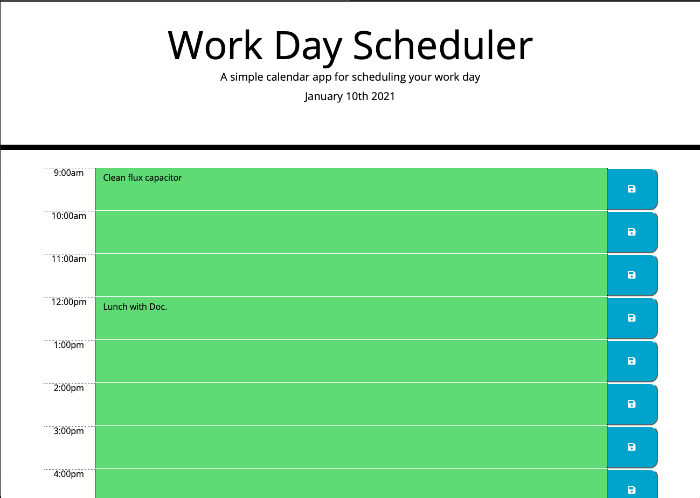

# Work-Day-Planner

## Application Description

https://wrightsah.github.io/Work-Day-Planner/

This application can be used as a simple to-do list for tasks during a standard workday. Blocks of time with change color depending on the time. Tasks can be saved, using the buttons, so you can close of out the application, reopen it, and your tasks will still be there! 

## Requirements

This website requires a web browser such as Safari, Firefox, Chrome, or Opera to view. 

## Credits

This site was built using Bootstrap and Moment.js. 

## Contact

You may contact me at wrightsah@icloud.com.

## License

This project uses the following license: [MIT License](LICENSE)
